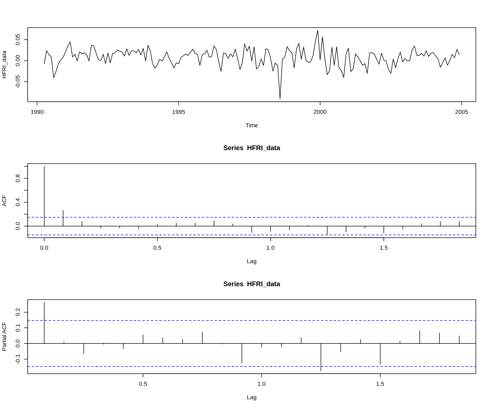

# Timeseries and Forecasting Methods
>Charalampos Kaidos

## Loading and exploring the data

The first thing to do is to load the data in the R workspace.
```R
header <- c("HFRI ", "EH", "M", "RVA", "ED", "CA", "DS", "EMN", "MA", "RUS_Rf", "RUS_1_Rf_1", "MXUS_Rf", "MEM_Rf", "SMB", "HML", "MOM", "SBGC_Rf", "SBWG_Rf", "LHY_Rf", "DEFSPR", "FRBI_Rf", "GSCI__Rf", "VIX", "Rf")
dates = seq(from = as.Date("1990-04-01", format='%Y-%m-%d'), to = as.Date("2005-12-01", format='%Y-%m-%d'), by = 'month')
as_data <- read.table("data_assignment.txt")
colnames(as_data) <- header
rownames(as_data) <- dates
```

Now we are going to plot all the dependent variables:
```R
par(mfrow=c(4,2))
for (col in c("HFRI ", "EH", "M", "RVA", "ED", "CA", "DS", "EMN")){
  plot(ts(data = as_data[[paste(col)]], start = c(1990, 4), end = c(2004, 12), frequency = 12), ylab = paste(col))
}
par(mfrow=c(1,1))
```


We are going to use the HFRI and DS variables for the analysis.

## Timeseries models

In the analysis and model fitting phase we will use the data from April 1990 to December 2004.

```R
HFRI_data <- ts(data = as_data$HFRI, start = c(1990, 4), end = c(2004, 12), frequency = 12)
DS_data <- ts(data = as_data$DS, start = c(1990, 4), end = c(2004, 12), frequency = 12)
```

### Stationarity

Before wokring on the models we need to make sure that the timeseries we are using are stationary processes. We will use the `ar()` function to automatically fit an AR model and perform an Augmented Dickey-Fuller test for the order decided by `ar()`.

```R
ar <- ar(HFRI_data)
adfTest(HFRI_data, lags = ar$order, type = "c")
```

```
Title:
 Augmented Dickey-Fuller Test

Test Results:
  PARAMETER:
    Lag Order: 1
  STATISTIC:
    Dickey-Fuller: -7.8606
  P VALUE:
    0.01

Description:
 Mon Feb 20 16:55:34 2017 by user: ckaidos

Warning message:
In adfTest(HFRI_data, lags = ar$order, type = "c") :
  p-value smaller than printed p-value
```

As the ADF test indicates, the HFRI series is stationary (for lag 1). P-value is less than 0.01 thus the H_0 hypothesis that HFRI is non-stationary is rejected.

```R
ar <- ar(DS_data)
adfTest(DS_data, lags = ar$order, type = "c")
```

```
Title:
 Augmented Dickey-Fuller Test

Test Results:
  PARAMETER:
    Lag Order: 2
  STATISTIC:
    Dickey-Fuller: -6.2674
  P VALUE:
    0.01

Description:
 Mon Feb 20 16:57:57 2017 by user: ckaidos

Warning message:
In adfTest(DS_data, lags = ar$order, type = "c") :
  p-value smaller than printed p-value
```

Again, as the ADF test indicated the DS series is stationary too. For DS the lag order is 2.

Since both timeseries are stationary processes we can apply ARMA models on them.

### Timeseries exploration

First we are going to work with the HFRI timeseries.

Bellow are the plots of the timeseries, the autocorrelation and partial autocorrelation plots.

```R
par(mfrow = c(3,1))
plot(HFRI_data)
acf(HFRI_data)
pacf(HFRI_data)
par(mfrow = c(1,1))
```



From the ACF plot we observe correlation on lag 1 while the PACF plot indicates partial autocorrelation on lag 1 and lag 15.

The Box-Pierce test bellow confirms these observations.

```R
Box.test(HFRI_data,1,type="Box-Pierce")
```
```
	Box-Pierce test

data:  HFRI_data
X-squared = 12.244, df = 1, p-value = 0.0004667
```

As does the Ljung-Box test.

```R
Box.test(HFRI_data,1,type="Ljung-Box")
```
```
	Box-Ljung test

data:  HFRI_data
X-squared = 12.453, df = 1, p-value = 0.0004173
```

Next up is the DS timeseries.

```R
par(mfrow = c(3,1))
plot(DS_data)
acf(DS_data)
pacf(DS_data)
par(mfrow = c(1,1))
```


From the ACF plot we observe correlation on lag 2 while the PACF plot indicates partial autocorrelation on lag 1 and lag 15.

The Box-Pierce test bellow confirms these observations.

```R
Box.test(DS_data,2,type="Box-Pierce")
```
```
	Box-Pierce test

data:  DS_data
X-squared = 51.85, df = 2, p-value = 5.506e-12
```

As does the Ljung-Box test.

```R
Box.test(DS_data,2,type="Ljung-Box")
```
```
	Box-Ljung test

data:  DS_data
X-squared = 52.762, df = 2, p-value = 3.49e-12
```

### Model fitting

Given the ACF and PACF plots above we choose to fit:

#### HFRI

A MA(1) model for HFRI:
```R
modelHFRI = arima(HFRI_data, order = c(0,0,1))
```
```
Call:
arima(x = HFRI_data, order = c(0, 0, 1))

Coefficients:
         ma1  intercept
      0.2357     0.0081
s.e.  0.0664     0.0018

sigma^2 estimated as 0.0003721:  log likelihood = 447.64,  aic = -889.28
```

#### DS

A MA(2) model for DS:
```R
modelDS = arima(DS_data, order = c(0,0,2))
```
```
Call:
arima(x = DS_data, order = c(0, 0, 2))

Coefficients:
         ma1     ma2  intercept
      0.6033  0.2295     0.0088
s.e.  0.0766  0.0745     0.0021

sigma^2 estimated as 0.0002294:  log likelihood = 490.28,  aic = -972.56
```
