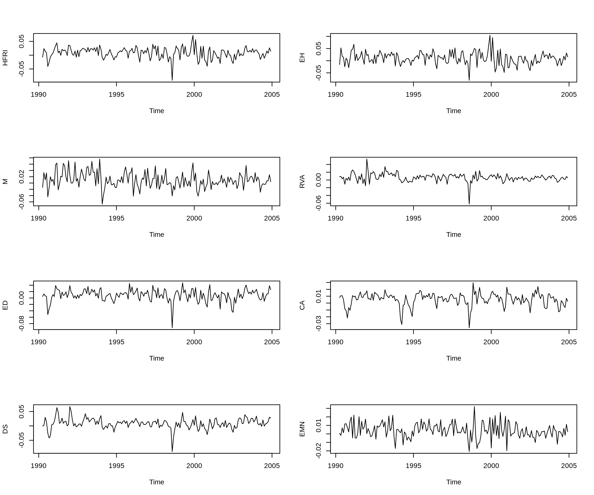
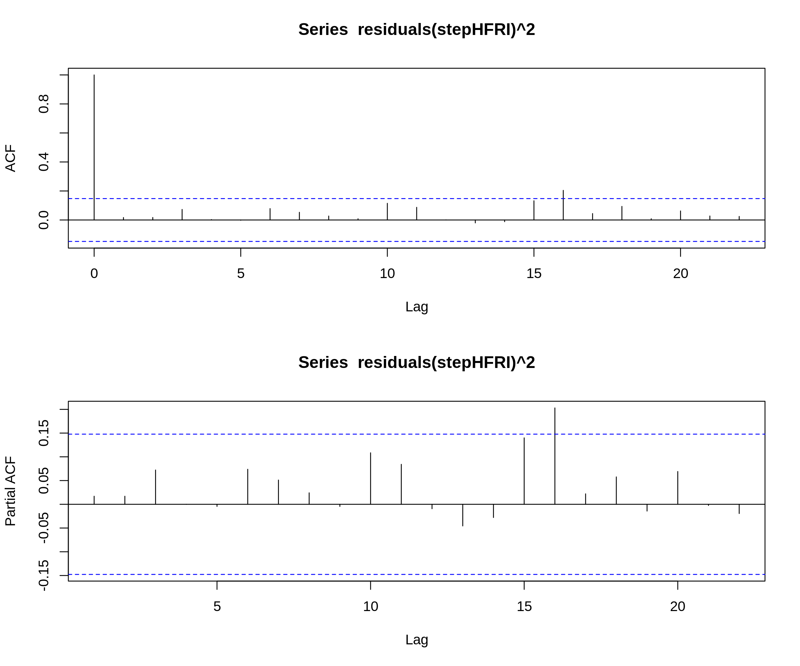
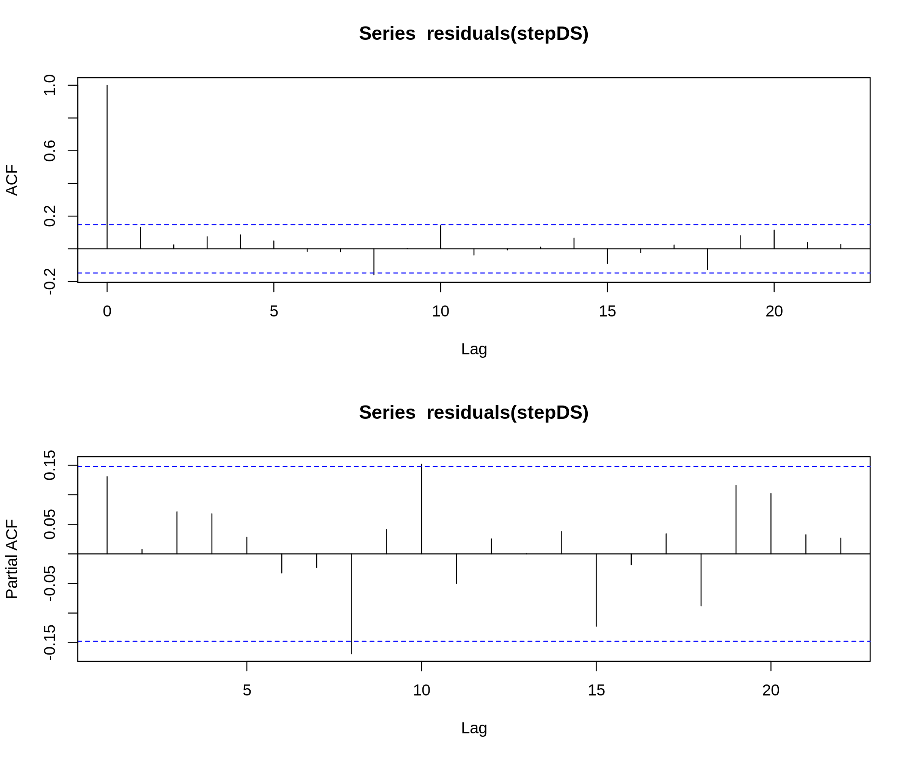
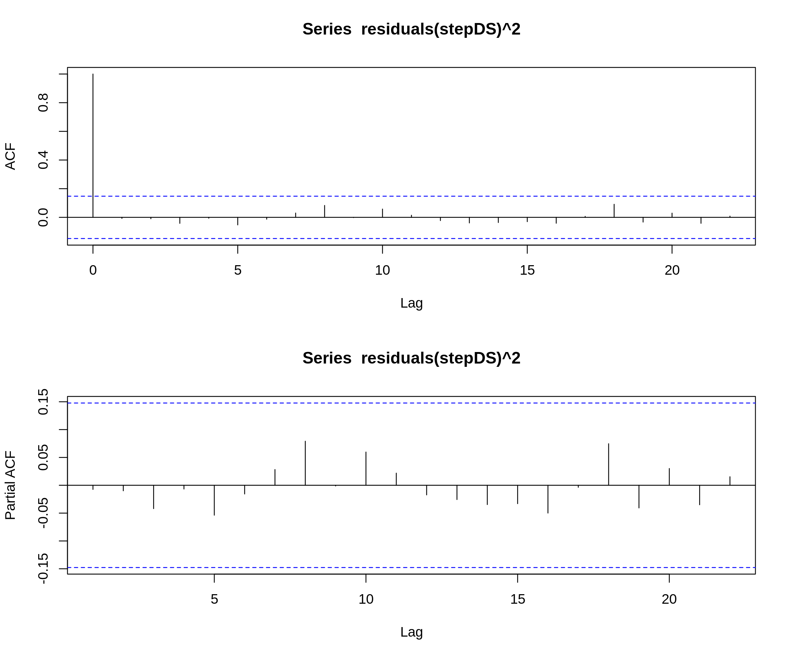

# Timeseries and Forecasting Methods
>Charalampos Kaidos

## Loading and exploring the data

The first thing to do is to load the data in the R workspace.
```R
header <- c("HFRI ", "EH", "M", "RVA", "ED", "CA", "DS", "EMN", "MA", "RUS_Rf", "RUS_1_Rf_1", "MXUS_Rf", "MEM_Rf", "SMB", "HML", "MOM", "SBGC_Rf", "SBWG_Rf", "LHY_Rf", "DEFSPR", "FRBI_Rf", "GSCI__Rf", "VIX", "Rf")
dates = seq(from = as.Date("1990-04-01", format='%Y-%m-%d'), to = as.Date("2005-12-01", format='%Y-%m-%d'), by = 'month')
as_data <- read.table("data_assignment.txt")
colnames(as_data) <- header
rownames(as_data) <- dates
```

Now we are going to plot all the dependent variables:
```R
par(mfrow=c(4,2))
for (col in c("HFRI ", "EH", "M", "RVA", "ED", "CA", "DS", "EMN")){
  plot(ts(data = as_data[[paste(col)]], start = c(1990, 4), end = c(2004, 12), frequency = 12), ylab = paste(col))
}
par(mfrow=c(1,1))
```



We are going to use the HFRI and DS variables for the analysis.

## Timeseries models

In the analysis and model fitting phase we will use the data from April 1990 to December 2004.

```R
HFRI_data <- ts(data = as_data$HFRI, start = c(1990, 4), end = c(2004, 12), frequency = 12)
DS_data <- ts(data = as_data$DS, start = c(1990, 4), end = c(2004, 12), frequency = 12)
```

### Stationarity

Before wokring on the models we need to make sure that the timeseries we are using are stationary processes. We will use the `ar()` function to automatically fit an AR model and perform an Augmented Dickey-Fuller test for the order decided by `ar()`.

```R
ar <- ar(HFRI_data)
adfTest(HFRI_data, lags = ar$order, type = "c")
```

```
Title:
 Augmented Dickey-Fuller Test

Test Results:
  PARAMETER:
    Lag Order: 1
  STATISTIC:
    Dickey-Fuller: -7.8606
  P VALUE:
    0.01

Description:
 Mon Feb 20 16:55:34 2017 by user: ckaidos

Warning message:
In adfTest(HFRI_data, lags = ar$order, type = "c") :
  p-value smaller than printed p-value
```

As the ADF test indicates, the HFRI series is stationary (for lag 1). P-value is less than 0.01 thus the H_0 hypothesis that HFRI is non-stationary is rejected.

```R
ar <- ar(DS_data)
adfTest(DS_data, lags = ar$order, type = "c")
```

```
Title:
 Augmented Dickey-Fuller Test

Test Results:
  PARAMETER:
    Lag Order: 2
  STATISTIC:
    Dickey-Fuller: -6.2674
  P VALUE:
    0.01

Description:
 Mon Feb 20 16:57:57 2017 by user: ckaidos

Warning message:
In adfTest(DS_data, lags = ar$order, type = "c") :
  p-value smaller than printed p-value
```

Again, as the ADF test indicated the DS series is stationary too. For DS the lag order is 2.

Since both timeseries are stationary processes we can apply ARMA models on them.

### Timeseries exploration

First we are going to work with the HFRI timeseries.

Bellow are the plots of the timeseries, the autocorrelation and partial autocorrelation plots.

```R
par(mfrow = c(3,1))
plot(HFRI_data)
acf(HFRI_data)
pacf(HFRI_data)
par(mfrow = c(1,1))
```


From the ACF plot we observe correlation on lag 1 while the PACF plot indicates partial autocorrelation on lag 1 and lag 15.

The Box-Pierce test bellow confirms these observations.

```R
Box.test(HFRI_data,1,type="Box-Pierce")
```
```
	Box-Pierce test

data:  HFRI_data
X-squared = 12.244, df = 1, p-value = 0.0004667
```

As does the Ljung-Box test.

```R
Box.test(HFRI_data,1,type="Ljung-Box")
```
```
	Box-Ljung test

data:  HFRI_data
X-squared = 12.453, df = 1, p-value = 0.0004173
```

Next up is the DS timeseries.

```R
par(mfrow = c(3,1))
plot(DS_data)
acf(DS_data)
pacf(DS_data)
par(mfrow = c(1,1))
```


From the ACF plot we observe correlation on lag 2 while the PACF plot indicates partial autocorrelation on lag 1 and lag 15.

The Box-Pierce test bellow confirms these observations.

```R
Box.test(DS_data,2,type="Box-Pierce")
```
```
	Box-Pierce test

data:  DS_data
X-squared = 51.85, df = 2, p-value = 5.506e-12
```

As does the Ljung-Box test.

```R
Box.test(DS_data,2,type="Ljung-Box")
```
```
	Box-Ljung test

data:  DS_data
X-squared = 52.762, df = 2, p-value = 3.49e-12
```

### Model fitting

Given the ACF and PACF plots above we choose to fit:

#### HFRI

A MA(1) model would be enough to capture the autocorrelation of HFRI, however we will alseo use MA(12) to be able to forecast for 12 periods. The MA(1) model and analysis follows:
```R
modelHFRI = arima(HFRI_data, order = c(0,0,1))
```
```
Call:
arima(x = HFRI_data, order = c(0, 0, 1))

Coefficients:
         ma1  intercept
      0.2357     0.0081
s.e.  0.0664     0.0018

sigma^2 estimated as 0.0003721:  log likelihood = 447.64,  aic = -889.28
```

The ACF and PACF plots of the residuals of the model are good, no more autocorrelation:


The Box-Pierce and Box-Ljung tests confirm the absence of autocorrelation:
```
	Box-Pierce test

data:  residuals(modelHFRI)
X-squared = 0.09725, df = 1, p-value = 0.7552
```
```
	Box-Ljung test

data:  residuals(modelHFRI)
X-squared = 0.098907, df = 1, p-value = 0.7531
```

The QQ-plot of the residuals indicates a problem at the tails of the distribution:


And the Shapiro test confirms it:
```
	Shapiro-Wilk normality test

data:  residuals(modelHFRI)
W = 0.97048, p-value = 0.000824
```

Finally, the squares of the residuals are not autocorrelated as can be seen in the ACF and PACF plots bellow:


The Box-Pierce and Box-Ljung tests confirm the absence of autocorrelation on the residuals:
```
	Box-Pierce test

data:  residuals(modelHFRI)^2
X-squared = 0.38769, df = 1, p-value = 0.5335
```
```
	Box-Ljung test

data:  residuals(modelHFRI)^2
X-squared = 0.3943, df = 1, p-value = 0.53
```

Now the MA(12) model and analysis:
```R
modelHFRI = arima(HFRI_data, order = c(0,0,12))
```
```
Call:
arima(x = HFRI_data, order = c(0, 0, 12))

Coefficients:
         ma1     ma2      ma3      ma4     ma5     ma6     ma7     ma8     ma9    ma10     ma11     ma12  intercept
      0.2356  0.0952  -0.0066  -0.0036  0.0086  0.1825  0.1748  0.1547  0.2845  0.1993  -0.0156  -0.0327     0.0077
s.e.  0.0766  0.0810   0.0823   0.0829  0.0829  0.0883  0.0829  0.0967  0.1007  0.0924   0.0920   0.0914     0.0031

sigma^2 estimated as 0.0003476:  log likelihood = 452.94,  aic = -877.89
```

The ACF and PACF plots of the residuals of the model are good, no more autocorrelation:


The Box-Pierce and Box-Ljung tests confirm the absence of autocorrelation:
```
	Box-Pierce test

data:  residuals(modelHFRI12)
X-squared = 3.1334, df = 12, p-value = 0.9945
```
```
	Box-Ljung test

data:  residuals(modelHFRI12)
X-squared = 3.3148, df = 12, p-value = 0.9929
```

The QQ-plot of the residuals indicates a problem at the tails of the distribution:


And the Shapiro test confirms it:
```
	Shapiro-Wilk normality test

data:  residuals(modelHFRI12)
W = 0.97788, p-value = 0.006425
```

Finally, the squares of the residuals are not autocorrelated as can be seen in the ACF and PACF plots bellow:


The Box-Pierce and Box-Ljung tests confirm the absence of autocorrelation on the residuals:
```
	Box-Pierce test

data:  residuals(modelHFRI12)^2
X-squared = 0.23451, df = 1, p-value = 0.6282
```
```
	Box-Ljung test

data:  residuals(modelHFRI12)^2
X-squared = 0.23851, df = 1, p-value = 0.6253
```

#### DS

A MA(2) model would be enough to capture the autocorrelation of DS. We will also fit a MA(12) to make predictions for 12 periods.
The MA(2) model and the analysis:
```R
modelDS = arima(DS_data, order = c(0,0,2))
```
```
Call:
arima(x = DS_data, order = c(0, 0, 2))

Coefficients:
         ma1     ma2  intercept
      0.6033  0.2295     0.0088
s.e.  0.0766  0.0745     0.0021

sigma^2 estimated as 0.0002294:  log likelihood = 490.28,  aic = -972.56
```

The ACF and PACF plots of the residuals of the model are good, no more autocorrelation:


The Box-Pierce and Box-Ljung tests confirm the absence of autocorrelation:
```
	Box-Pierce test

data:  residuals(modelDS)
X-squared = 0.011726, df = 1, p-value = 0.9138
```
```
	Box-Ljung test

data:  residuals(modelDS)
X-squared = 0.011926, df = 1, p-value = 0.913
```
The QQ-plot of the residuals indicates a problem at the tails of the distribution:


And the Shapiro test confirms it:
```
	Shapiro-Wilk normality test

data:  residuals(modelDS)
W = 0.92785, p-value = 1.047e-07
```

Finally, the squares of the residuals are not autocorrelated as can be seen in the ACF and PACF plots bellow:


The Box-Pierce and Box-Ljung tests confirm the absence of autocorrelation on the residuals:
```
	Box-Pierce test

data:  residuals(modelDS)^2
X-squared = 0.01825, df = 1, p-value = 0.8925
```
```
	Box-Ljung test

data:  residuals(modelDS)^2
X-squared = 0.018561, df = 1, p-value = 0.8916
```

The MA(12) model and the analysis:
```R
modelDS = arima(DS_data, order = c(0,0,12))
```
```
Call:
arima(x = DS_data, order = c(0, 0, 12))

Coefficients:
         ma1     ma2      ma3     ma4     ma5     ma6      ma7      ma8      ma9    ma10    ma11    ma12  intercept
      0.6271  0.1868  -0.0201  0.1244  0.0488  0.0436  -0.0071  -0.1619  -0.1173  0.0126  0.0498  0.1677     0.0088
s.e.  0.0781  0.0913   0.0970  0.0943  0.1017  0.1062   0.0882   0.1160   0.1303  0.0974  0.1097  0.0859     0.0022

sigma^2 estimated as 0.0002181:  log likelihood = 494.31,  aic = -960.62
```

The ACF and PACF plots of the residuals of the model are good, no more autocorrelation:


The Box-Pierce and Box-Ljung tests confirm the absence of autocorrelation:
```
	Box-Pierce test

data:  residuals(modelDS12)
X-squared = 0.022028, df = 1, p-value = 0.882
```
```
	Box-Ljung test

data:  residuals(modelDS12)
X-squared = 0.022403, df = 1, p-value = 0.881
```
The QQ-plot of the residuals indicates a problem at the tails of the distribution:


And the Shapiro test confirms it:
```
	Shapiro-Wilk normality test

data:  residuals(modelDS12)
W = 0.93095, p-value = 1.786e-07
```

Finally, the squares of the residuals are not autocorrelated as can be seen in the ACF and PACF plots bellow:


The Box-Pierce and Box-Ljung tests confirm the absence of autocorrelation on the residuals:
```
	Box-Pierce test

data:  residuals(modelDS12)^2
X-squared = 0.016717, df = 1, p-value = 0.8971
```
```
	Box-Ljung test

data:  residuals(modelDS12)^2
X-squared = 0.017002, df = 1, p-value = 0.8963
```

## Linear Regression

In this section we will try to use linear regression to fit the dependent variables based on the independent ones. 


To achieve this regression on previous values of the independent variables, we need to created new columns containing the shifted values

```R
shifted_data <- shift.column(data = as_data, up = FALSE, columns = c("RUS_Rf", "RUS_1_Rf_1", "MXUS_Rf", "MEM_Rf", "SMB", "HML", "MOM", "SBGC_Rf", "SBWG_Rf", "LHY_Rf", "DEFSPR", "FRBI_Rf", "GSCI__Rf", "VIX", "Rf"))
```

### HFRI linear model fit

We will work with the HFRI series first. We will fit the model on all the independent variables and then use a stepwise algorithm based on AIC to find the model with the largest (absolute) AIC value.
```R
fitHFRI <- lm(HFRI ~ RUS_Rf.Shifted + RUS_1_Rf_1.Shifted + MXUS_Rf.Shifted + MEM_Rf.Shifted + SMB.Shifted + HML.Shifted + MOM.Shifted + SBGC_Rf.Shifted + SBWG_Rf.Shifted + LHY_Rf.Shifted + DEFSPR.Shifted + FRBI_Rf.Shifted + GSCI__Rf.Shifted + VIX.Shifted + Rf.Shifted, shifted_data)
stepHFRI <- stepAIC(fitHFRI, direction="both", trace = 0)
```
The summary of the fitted model:
```
Call:
lm(formula = HFRI ~ MEM_Rf.Shifted, data = shifted_data)

Residuals:
      Min        1Q    Median        3Q       Max 
-0.100704 -0.010566  0.001039  0.012256  0.058643 

Coefficients:
               Estimate Std. Error t value Pr(>|t|)    
(Intercept)    0.008036   0.001472   5.458 1.64e-07 ***
MEM_Rf.Shifted 0.067441   0.021627   3.118  0.00213 ** 
---
Signif. codes:  0 ‘***’ 0.001 ‘**’ 0.01 ‘*’ 0.05 ‘.’ 0.1 ‘ ’ 1

Residual standard error: 0.01952 on 174 degrees of freedom
Multiple R-squared:  0.05293,	Adjusted R-squared:  0.04749 
F-statistic: 9.724 on 1 and 174 DF,  p-value: 0.002128
```
The selected model has 1 independent variable parameters. The model was chosen based on AIC but the P-value is also significant.

The process and changes on the AIC value are presented with ANOVA:
```
Stepwise Model Path 
Analysis of Deviance Table

Initial Model:
HFRI ~ RUS_Rf.Shifted + RUS_1_Rf_1.Shifted + MXUS_Rf.Shifted + 
    MEM_Rf.Shifted + SMB.Shifted + HML.Shifted + MOM.Shifted + 
    SBGC_Rf.Shifted + SBWG_Rf.Shifted + LHY_Rf.Shifted + DEFSPR.Shifted + 
    FRBI_Rf.Shifted + GSCI__Rf.Shifted + VIX.Shifted + Rf.Shifted

Final Model:
HFRI ~ MEM_Rf.Shifted


                   Step Df     Deviance Resid. Df Resid. Dev       AIC
1                                             160 0.06363065 -1362.825
2     - SBGC_Rf.Shifted  1 7.522408e-06       161 0.06363817 -1364.805
3          - Rf.Shifted  1 1.675280e-05       162 0.06365492 -1366.758
4     - MXUS_Rf.Shifted  1 3.734261e-05       163 0.06369227 -1368.655
5         - MOM.Shifted  1 6.125003e-05       164 0.06375352 -1370.486
6     - FRBI_Rf.Shifted  1 8.606730e-05       165 0.06383958 -1372.248
7     - SBWG_Rf.Shifted  1 9.142439e-05       166 0.06393101 -1373.997
8      - DEFSPR.Shifted  1 8.944197e-05       167 0.06402045 -1375.750
9      - RUS_Rf.Shifted  1 1.141161e-04       168 0.06413457 -1377.437
10        - SMB.Shifted  1 1.885882e-04       169 0.06432315 -1378.920
11     - LHY_Rf.Shifted  1 1.205192e-04       170 0.06444367 -1380.591
12   - GSCI__Rf.Shifted  1 3.380880e-04       171 0.06478176 -1381.670
13        - VIX.Shifted  1 4.475212e-04       172 0.06522928 -1382.458
14 - RUS_1_Rf_1.Shifted  1 3.709890e-04       173 0.06560027 -1383.460
15        - HML.Shifted  1 7.277621e-04       174 0.06632803 -1383.518
```

### DS linear model fit

Following the same pattern, we fit a linear model for the DS series using all independent variables and then use the stepwise algorithm to select the optimal model.

```R
fitDS <- lm(DS ~ RUS_Rf.Shifted + RUS_1_Rf_1.Shifted + MXUS_Rf.Shifted + MEM_Rf.Shifted + SMB.Shifted + HML.Shifted + MOM.Shifted + SBGC_Rf.Shifted + SBWG_Rf.Shifted + LHY_Rf.Shifted + DEFSPR.Shifted + FRBI_Rf.Shifted + GSCI__Rf.Shifted + VIX.Shifted + Rf.Shifted, shifted_data)
stepDS <- stepAIC(fitDS, direction="both", trace = 0)
```

The summary of the selected model:
```
Call:
lm(formula = DS ~ RUS_Rf.Shifted + RUS_1_Rf_1.Shifted + MEM_Rf.Shifted + 
    SMB.Shifted + HML.Shifted + SBWG_Rf.Shifted + FRBI_Rf.Shifted + 
    Rf.Shifted, data = shifted_data)

Residuals:
      Min        1Q    Median        3Q       Max 
-0.089433 -0.008916  0.000121  0.007841  0.045861 

Coefficients:
                    Estimate Std. Error t value Pr(>|t|)    
(Intercept)         0.011516   0.003112   3.700 0.000292 ***
RUS_Rf.Shifted      0.100514   0.039356   2.554 0.011545 *  
RUS_1_Rf_1.Shifted  0.059818   0.029864   2.003 0.046791 *  
MEM_Rf.Shifted      0.058664   0.026187   2.240 0.026401 *  
SMB.Shifted         0.106444   0.041194   2.584 0.010623 *  
HML.Shifted         0.052924   0.032996   1.604 0.110612    
SBWG_Rf.Shifted     0.151945   0.072579   2.094 0.037815 *  
FRBI_Rf.Shifted     0.301988   0.116229   2.598 0.010209 *  
Rf.Shifted         -1.163379   0.816345  -1.425 0.155993    
---
Signif. codes:  0 ‘***’ 0.001 ‘**’ 0.01 ‘*’ 0.05 ‘.’ 0.1 ‘ ’ 1

Residual standard error: 0.01524 on 167 degrees of freedom
Multiple R-squared:  0.3166,	Adjusted R-squared:  0.2839 
F-statistic: 9.672 on 8 and 167 DF,  p-value: 5.578e-11
```

The stepwise algorithm has created a much more complex model with 8 independent variables. The selection process follows:
```
Stepwise Model Path 
Analysis of Deviance Table

Initial Model:
DS ~ RUS_Rf.Shifted + RUS_1_Rf_1.Shifted + MXUS_Rf.Shifted + 
    MEM_Rf.Shifted + SMB.Shifted + HML.Shifted + MOM.Shifted + 
    SBGC_Rf.Shifted + SBWG_Rf.Shifted + LHY_Rf.Shifted + DEFSPR.Shifted + 
    FRBI_Rf.Shifted + GSCI__Rf.Shifted + VIX.Shifted + Rf.Shifted

Final Model:
DS ~ RUS_Rf.Shifted + RUS_1_Rf_1.Shifted + MEM_Rf.Shifted + SMB.Shifted + 
    HML.Shifted + SBWG_Rf.Shifted + FRBI_Rf.Shifted + Rf.Shifted


                Step Df     Deviance Resid. Df Resid. Dev       AIC
1                                          160 0.03774065 -1454.760
2  - SBGC_Rf.Shifted  1 5.058967e-08       161 0.03774070 -1456.760
3   - LHY_Rf.Shifted  1 1.035588e-04       162 0.03784426 -1458.278
4      - MOM.Shifted  1 9.982741e-05       163 0.03794409 -1459.814
5 - GSCI__Rf.Shifted  1 1.348885e-04       164 0.03807898 -1461.190
6      - VIX.Shifted  1 2.120449e-04       165 0.03829102 -1462.212
7  - MXUS_Rf.Shifted  1 2.451101e-04       166 0.03853613 -1463.089
8   - DEFSPR.Shifted  1 2.762344e-04       167 0.03881237 -1463.832
```

## Linear model analysis and correction

### HFRI model

First diagnostic for every linear model is through the plots of the residuals.
```R
par(mfrow=c(2,2))
plot(stepHFRI)
par(mfrow=c(1,1))
```


Starting from normallity of residuals, one can easily observe on the QQ-plot that the residuals are problematic at the left tail of the distribution. The Shapiro-Wilk test on the residuals confirms that:
```
	Shapiro-Wilk normality test

data:  residuals(stepHFRI)
W = 0.95846, p-value = 4.502e-05
```

The ACF and PACF plots bellow indicate no autocorrelation on the residuals of the fitted model.


The Box-Pierce and Ljung-Box tests on the residuals confirm this:
```
	Box-Pierce test

data:  residuals(stepHFRI)
X-squared = 0.72401, df = 1, p-value = 0.3948
```
```
	Box-Ljung test

data:  residuals(stepHFRI)
X-squared = 0.73642, df = 1, p-value = 0.3908
```

Also, the Residual vs Fitted plot above shows no indication of heteroscedasticity even though data are slightly shifted left from 0. The ACF and PACF plots on the squared residuals indicate that there is no autocorrelation in the squares of the residuals.



The Box-Pierce and Box-Ljung tests for autocorrelation at squared residuals indicate homoscedasticity.
```
	Box-Pierce test

data:  residuals(stepHFRI)^2
X-squared = 0.10344, df = 2, p-value = 0.9496
```
```
	Box-Ljung test

data:  residuals(stepHFRI)^2
X-squared = 0.10552, df = 2, p-value = 0.9486
```

### DS Model

The plots of residuals of the linear model:
```R
par(mfrow=c(2,2))
plot(stepDS)
par(mfrow=c(1,1))
```


On the QQ-plot that the residuals are problematic at the tails of the distribution. The Shapiro-Wilk test on the residuals confirms that:
```
	Shapiro-Wilk normality test

data:  residuals(stepDS)
W = 0.92826, p-value = 1.202e-07
```

The ACF and PACF plots bellow indicate no autocorrelation on the residuals of the fitted model.



The Box-Pierce and Ljung-Box tests on the residuals confirm no autocorrelation:
```
	Box-Pierce test

data:  residuals(stepDS)
X-squared = 10.302, df = 8, p-value = 0.2445
```
```
	Box-Ljung test

data:  residuals(stepDS)
X-squared = 10.714, df = 8, p-value = 0.2184
```

The scale location and Residuals vs Fitted plots above indicate no issue of heteroscedasticity. The ACF and PACF plots on the squared residuals confirm that:



The Box-Pierce and Box-Ljung tests for autocorrelation at squared residuals indicate homoscedasticity.
```
	Box-Pierce test

data:  residuals(stepDS)^2
X-squared = 0.0097234, df = 1, p-value = 0.9214
```
```
	Box-Ljung test

data:  residuals(stepDS)^2
X-squared = 0.0098901, df = 1, p-value = 0.9208
```

### Correcting autocorrelation with ARMA models for residuals

As the diagnostics show that both ARIMA and regression models have no issues with autocorrelation or heteroscedasticity, there is no need to combine these models. However during experimentation methods were created to accound for autocorrelation of residuals and heteroscedasticity and can be found in the code (commented out, with a note on top)

## Model Selection

### Model specification

The models constructed are the following:

ModelHFRI: MA(1)


ModelDS: MA(2)


ModelHFRI12: MA(12)


ModelDS12: MA(12)


stepHFRI: Linear Model


stepDS: Linear Model


### AIC values

ModelHFRI|ModelHFRI12|stepHFRI
---------|-----------|--------
-889.2824|-877.8891|-1383.518

ModelDS|ModelDS12|stepDS
-------|---------|--------
-972.5627|-960.622|-1463.832

As expected, the MA(12) models have lower AIC value since they contain lots of "junk" parameters with large variance. Also, the linear models demonstrate better AIC values.

## Forecast

### HFRI

We use the predict() method to forecast values unseen. We will use all models to predict the timeseries for the left out data of 2005.

```R
forecastMA1HFRI <- predict(modelHFRI, 12)
forecastMA12HFRI <- predict(modelHFRI12, 12)
forecastLMHFRI <- predict(stepHFRI, shifted_data_new, se.fit = TRUE)
```

The following plots show the whole timeseries, the left out data and the prediction in red color. With blue is S.E of the prediction:


The MSFE is calculated with the formula bellow:
```R
msfeMA1HFRI <- sum((forecastMA1HFRI$pred - shifted_data_new$HFRI)^2)/12
msfeMA12HFRI <- sum((forecastMA12HFRI$pred - shifted_data_new$HFRI)^2)/12
msfeLMHFRI <- sum((forecastLMHFRI$fit - shifted_data_new$HFRI)^2)/12
```
The results are:
MA(1) HFRI MSFE: 0.0001830464
MA(12) HFRI MSFE: 0.0001808294
LM HFRI MSFE: 0.0002173593

The hit ratio is calculated like this:
```R
hitMA1HFRI <- sum((forecastMA1HFRI$pred * shifted_data_new$HFRI) > 0)/12
hitMA12HFRI <- sum((forecastMA12HFRI$pred * shifted_data_new$HFRI) > 0)/12
hitLMHFRI <- sum((forecastLMHFRI$fit * shifted_data_new$HFRI) > 0)/12
```

The results are:
MA(1) HFRI HR: 66.6%
MA(12) HFRI HR: 58.3%
LM HFRI HR: 66.6%

The hit ratio is not accurate as all the predictions where positive values.
The MA(12) has the best MSFE but not by far, second being the MA(1) model.

### DS

The predictions where made as follows:
```R
forecastMA1DS <- predict(modelDS, 12)
forecastMA12DS <- predict(modelDS12, 12)
forecastLMDS <- predict(stepDS, shifted_data_new, se.fit = TRUE)
```

The following plots show the whole timeseries, the left out data and the prediction in red color. With blue is S.E of the prediction:


The MSFE is calculated with the formula bellow:
```R
msfeMA1DS <- sum((forecastMA1DS$pred - shifted_data_new$DS)^2)/12
msfeMA12DS <- sum((forecastMA12DS$pred - shifted_data_new$DS)^2)/12
msfeLMDS <- sum((forecastLMDS$fit - shifted_data_new$DS)^2)/12
```

The results are:
MA(2) DS MSFE: 9.752394e-05
MA(12) DS MSFE: 0.0001227059
LM HFRI MSFE: 8.255168e-05

The hit ratio is calculated like this:
```R
hitMA1DS <- sum((forecastMA1DS$pred * shifted_data_new$DS) > 0)/12
hitMA12DS <- sum((forecastMA12DS$pred * shifted_data_new$DS) > 0)/12
hitLMDS <- sum((forecastLMDS$fit * shifted_data_new$DS) > 0)/12
```

The results are:
MA(2) DS HR: 66.6%
MA(12) DS HR: 66.6%
LM DS HR: 66.6%

In this series, the linear model does the most accurate prediction but the MA(2) model is very close.

## Conclusion

As a conclusion for this exercise I'll make the observation that "overfitting" can destroy an otherwise unsuspecting model. The MA(1) and MA(2) models which performed static predictions for most of 2005 where better (given the cost and complexity) from the MA(12) models. Another observation is that traditional simple linear regression can also perform great, at least as long as there are no autocorrelations or serious heteroscedatocity.